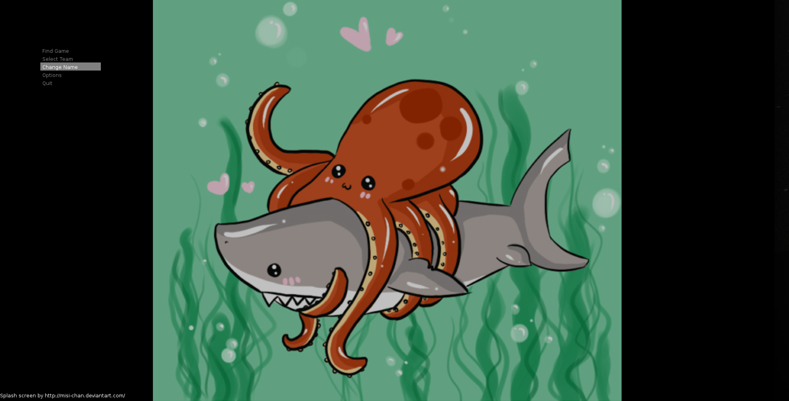
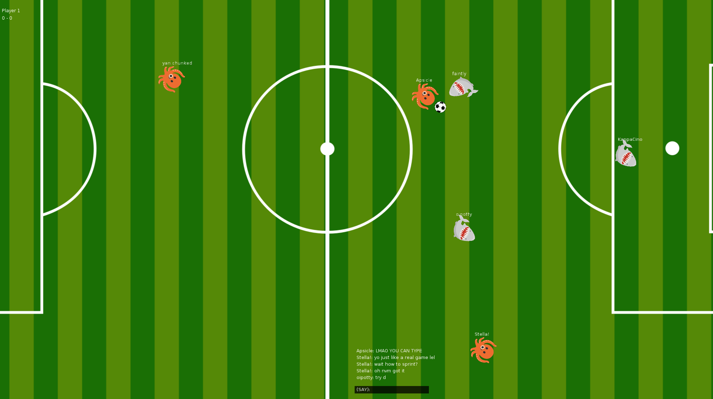

# Octosoccer

Multiplayer soccer game made with Lua LOVE library, sock.lua / bitser for networking / serialization, and featuring the Recurse Center Octopus! Kind of inspired by Dota Strikers. Juke, score, trash talk! 

I'm trying to set up a metaserver as a game coordinator on a cloud hosting site so people can play without me having to set up a server but don't really have any expertise in this field. If you do and want to help then please contact me!

Cute splash screen. Image credit to: [Misi-chan](http://misi-chan.deviantart.com/)

In-game screenshot
